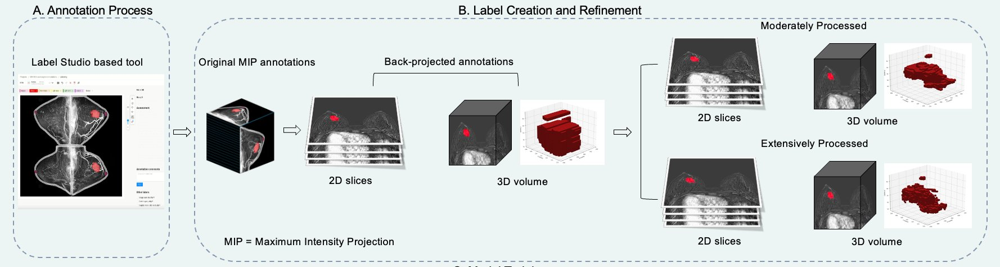

# Balancing Complexity and Feasibility: Optimizing Clinical Data for Breast MRI Segmentation



## Repository Contents

This repository provides the code accompanying the paper, organized in three modules:

1. **MIP Creation** — Generation of Maximum Intensity Projection (MIP) images from pre- and post-contrast DCE-MRI series.

2. **Label Studio Configuration** — Setup and configuration for the Label Studio-based annotation tool used for MIP annotation.

3. **Label Back-Projection and Refinement** — Back-projection of 2D MIP annotations to 3D volumes, with three levels of label refinement (unprocessed, moderately processed, extensively processed).


## Usage

**1. Clone the repo and set up the environment.**

```bash
git clone <repo-url> mammotation2025-labelstudio-test
cd mammotation2025-labelstudio-test

conda create -n mammotation2025 python=3.12 -y
conda activate mammotation2025

pip install poetry
poetry install --extras labelstudio
```

**2. Prepare the working directories.**

```bash
mkdir -p label-studio/label-studio/data
mkdir -p label-studio/label-studio/images
mkdir -p label-studio-data-8083
```

**3. Add one or more tasks to the data directory.**

Each task folder must contain a pre-contrast and post-contrast DICOM series directory. The folder name determines the MIP filename (`task_001` → `001.png`).

```text
label-studio/label-studio/data/
  task_001/
    3.000000-ax dyn pre-93877/
    5.000000-ax dyn 1st pass-59529/
  task_002/
    ...
```

To use the sample data shipped with the repo:

```bash
cp -a tests/data/task_1 label-studio/label-studio/data/task_001
```

**4. Start Label Studio.** Run this in a dedicated terminal and leave it running.

```bash
LABEL_STUDIO_LOCAL_FILES_SERVING_ENABLED=true \
LOCAL_FILES_DOCUMENT_ROOT="$PWD" \
label-studio start mammotation-project \
  --data-dir "$PWD/label-studio-data-8083" \
  --no-browser \
  --username admin@example.com \
  --password testAdmin \
  --user-token ls_token_8083 \
  --init \
  --port 8083
```

**5. Generate MIPs and import tasks into Label Studio.** This runs scripts 01 and 02 internally, then imports the tasks.

Process all tasks in `label-studio/label-studio/data/`:

```bash
python scripts/03_run_label_studio_workflow.py
```

Or process only one specific task:

```bash
python scripts/03_run_label_studio_workflow.py --task task_001
```

**6. Annotate in Label Studio.** Open http://localhost:8083 in your browser (login: `admin@example.com` / `testAdmin`), open the project, and annotate each task.

**7. Register annotations into coarse 3D labels.**

All tasks:

```bash
python scripts/04_register_annotations.py
```

One task:

```bash
python scripts/04_register_annotations.py --task task_001
```

**8. Refine the coarse labels.**

All tasks:

```bash
python scripts/05_refine_labels.py
```

One task:

```bash
python scripts/05_refine_labels.py --task task_001
```

**9. Export the final NIfTI outputs.**

All tasks:

```bash
python scripts/06_save_outputs.py
```

One task (with optional custom output folder name):

```bash
python scripts/06_save_outputs.py --task task_001 --study-id my_case_001
```

Outputs are written to `label-studio/label-studio/images/final/<task_name>/` and contain:

```text
pre_contrast.nii.gz
post_contrast.nii.gz
subtraction.nii.gz
labels/
  <label>_coarse.nii.gz
  <label>_moderately_processed.nii.gz
  <label>_extensively_processed.nii.gz
```

